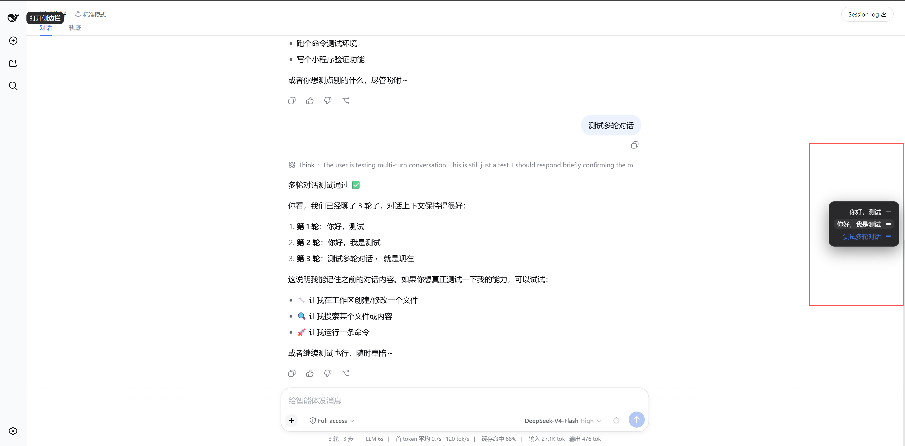
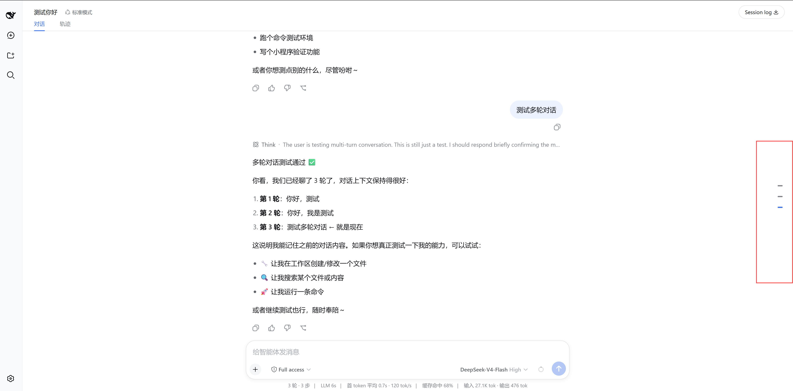

# dsh-quick-view

A [dsh](https://github.com/deepseek-ai/deepseek-harness) web client plugin that adds a **floating right-side navigator** to the conversation page. In a long session it is hard to find where you earlier asked something; this plugin lists every user input down the right edge and jumps the transcript to that message on click.

It is a browser-only (`dsh.client`) bundle — no host service, no tool, no prompt change. It registers into the `conversation.session.header.utilities` slot that the dsh web bundle already declares, so it composes into the shipped UI without any repo change.





## Install

Two ways, mirroring other dsh plugins. Both need the dsh CLI on `PATH`.

### 1. From the npm registry (recommended — no clone or build step)

```sh
dsh plugin --profile web add @pengls/dsh-quick-view
```

The published tarball ships the prebuilt `lib/`, so `pnpm` installs it and `dsh` activates its patch layer — no `prepare` script runs.

### 2. From GitHub source

```sh
dsh plugin --profile web add github:pengls/dsh-quick-view
```

A git install fetches **sources**, which is fine here: this repo commits its built `lib/`, so a plain `dsh plugin add github:pengls/dsh-quick-view` needs no build step and hits no `allowBuilds` gate. Rebuild `lib/` (`npm run build`) only when you edit `src/`.

## Use

1. Restart the profile: `dsh --profile web`.
2. Open a session with at least two of your own inputs. A rail of short dashes appears on the right edge, vertically centered — one dash per user input, in conversation order (first at top). The last input's dash is selected (blue) by default.
3. Hover the rail to expand a panel where each input becomes a `text + dash` row; click a row to scroll the transcript to that message and mark its dash selected.

## How it works

`cordis.patch.yml` inserts one row mounting this package as a `dsh.client` plugin; `package.json` declares `dsh.client` (`platform: 'web'`), so the host's client-modules node half scans its `./client` export into `window.__DSH_BOOT__`. The browser half (`src/client/index.ts`) registers a list occupant of `conversation.session.header.utilities` via `ctx.slots.inject(...)` — the safe cross-package registration that waits on ui-conversation's slot declaration.

`QuickViewPanel.tsx` reads only the framework session kit (`useSession` → `conversation.chat.order`/`nodes`) and builds the list. Clicking an entry uses the semantic anchor `[data-chat-anchor-key]` the chat view stamps, then scrolls its `[data-conversation-scroll]` scrollport — so it works across reflow and load-older pagination. No store, no business layer, no host round trip.

The browser half is built as an **out-of-repo closure-factory bundle**: `scripts/build.mjs` (esbuild) externalizes the shell baseline (`react`, `react/jsx-runtime`, `@deepseek-ai/cordis`, `@deepseek-ai/dsh-client-ui-slots`, `@deepseek-ai/dsh-client-ui-primitives`, `@deepseek-ai/dsh-client-runtime/client`) and wraps output in `window.__ModuleLoader__.load({ id, factory: (require) => { … } })`.

## Development

```sh
npm install
npm run build                 # emits lib/index.js + lib/client.js
npm run typecheck             # validates src/ against the dsh type sources
```

`tsconfig.json` extends `../../deepseek-harness/tsconfig.base.client.json` so `@deepseek-ai/*` resolves to real type sources; point `extends` at your dsh checkout if it lives elsewhere. The build itself uses esbuild and does not need the checkout.

## Releasing a new version

Both install paths above resolve the same package, so every release means bumping, pushing, and publishing in one sweep:

```sh
# 1. Bump the version in package.json (semver: 0.1.1, 0.2.0, …)
# 2. Rebuild and commit lib/ (kept in git so GitHub installs need no build)
npm run build
git add -A
git commit -m "Release v<version>"
git push origin main
# 3. Publish to npm (prepack also rebuilds lib/)
npm publish --access public --registry https://registry.npmjs.org/
```

Notes:

- Publishing needs npm auth plus either an OTP (append `--otp <code>`) or a granular access token with **Bypass two-factor authentication** enabled. `--access public` is required because scoped packages default to private.
- If your npm `registry` is a read-only mirror (e.g. npmmirror), log in and publish against `https://registry.npmjs.org/` explicitly, as above.
- `lib/` is generated; always rebuild before committing so the committed artifact matches `src/`.

## Model Experience

This plugin adds no host prompt section, no tool schema, and no model-visible input. Its only effect is a client-side floating control; it does not change the session log or the model context.
